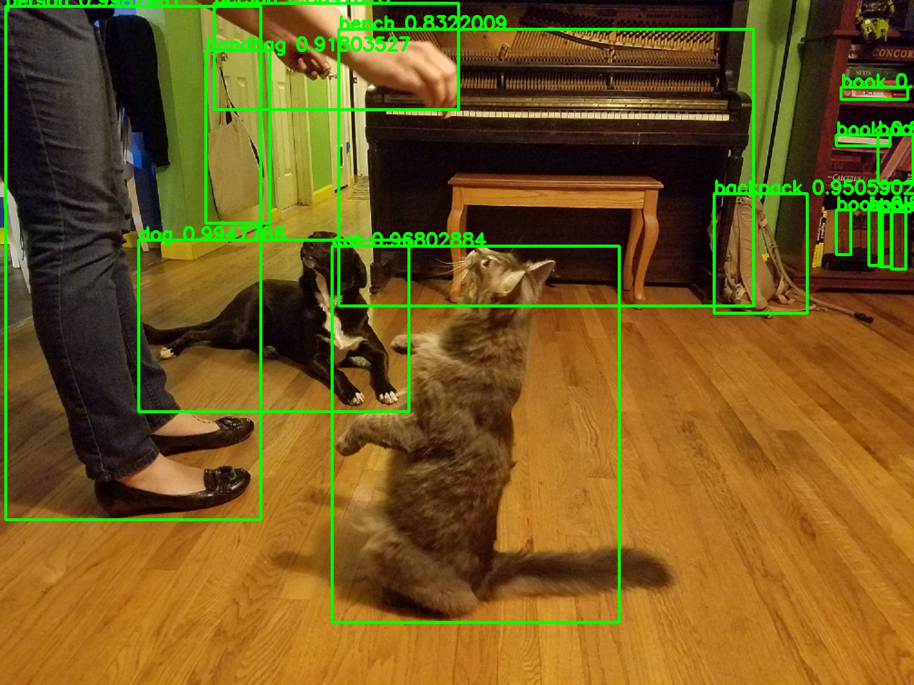

## Identifying and Counting Objects with Computer Vision Neural Networks

Using PyTorch's pre-trained Faster R-CNN model, you can set up a computer vision system that quickly identifies objects in photographs. The hardest part of the process is getting PyTorch installed and configured. [Installation instructions for PyTorch.](https://pytorch.org/get-started/locally/) The model is pre-trained using the [COCO image dataset](https://cocodataset.org/#home) and will provide a list of bounding boxes for the objects detected, labels assigned to each bounding box, and the probability for each prediction.

Start by calling the model and setting it to evaluate.

```python
model = torchvision.models.detection.fasterrcnn_resnet50_fpn(pretrained=True)
model.eval()
```

Next you need the COCO dataset labels for reference. The model will return the index number for the list.

```python
COCO_INSTANCE_CATEGORY_NAMES = [
    '__background__', 'person', 'bicycle', 'car', 'motorcycle', 'airplane', 'bus',
    'train', 'truck', 'boat', 'traffic light', 'fire hydrant', 'N/A', 'stop sign',
    'parking meter', 'bench', 'bird', 'cat', 'dog', 'horse', 'sheep', 'cow',
    'elephant', 'bear', 'zebra', 'giraffe', 'N/A', 'backpack', 'umbrella', 'N/A', 'N/A',
    'handbag', 'tie', 'suitcase', 'frisbee', 'skis', 'snowboard', 'sports ball',
    'kite', 'baseball bat', 'baseball glove', 'skateboard', 'surfboard', 'tennis racket',
    'bottle', 'N/A', 'wine glass', 'cup', 'fork', 'knife', 'spoon', 'bowl',
    'banana', 'apple', 'sandwich', 'orange', 'broccoli', 'carrot', 'hot dog', 'pizza',
    'donut', 'cake', 'chair', 'couch', 'potted plant', 'bed', 'N/A', 'dining table',
    'N/A', 'N/A', 'toilet', 'N/A', 'tv', 'laptop', 'mouse', 'remote', 'keyboard', 'cell phone',
    'microwave', 'oven', 'toaster', 'sink', 'refrigerator', 'N/A', 'book',
    'clock', 'vase', 'scissors', 'teddy bear', 'hair drier', 'toothbrush'
]
```

You will need to convert your image into a tensor matrix. Here is a simple predict function that takes the path of an image and runs it through the model. The function has a threshold input which sets the minimum value for prediction.

For this function you need the following imports:

```python
from PIL import Image
import torchvision.transforms as T
```

The function returns the coordinates for the bounding boxes, the labels, and a count of the objects. Counting objects in photos has many practical uses, from supply chain to monitoring traffic on a freeway.

```python
def predict(img_path, threshold):
    """Prediction Function"""

    # load image from path
    image = Image.open(img_path)

    # Define Tensor transfomation for Pytorch
    transform = T.Compose([T.ToTensor()])

    # Transform image
    image = transform(image)

    # Get prediction from model
    pred = model([image])

    # Get prediction classes
    labels = list(pred[0]['labels'].numpy())
    pred_class= [COCO_INSTANCE_CATEGORY_NAMES[i] for i in labels]

    # Get Prediction boxes
    pred_boxes = [[(i[0], i[1]), (i[2], i[3])] for i in list(pred[0]['boxes'].detach().numpy())] # Bounding boxes
    pred_score = list(pred[0]['scores'].detach().numpy())

    # Get indexes for predictions above the threshold
    pred_t = [pred_score.index(x) for x in pred_score if x > threshold][-1] # Get list of index with score greater than threshold.

    # Remove the predictions below the threshold
    pred_boxes = pred_boxes[:pred_t+1]
    pred_class = pred_class[:pred_t+1]

    # Get object counts
    obj_counts = {}
    for obj in set(pred_class):
        obj_counts[obj] = pred_class.count(obj)


    return pred_boxes, pred_class, obj_counts
```

To return the image with the bounding boxes and labels, you can use the prediction function as a helper function. You will need to install and import [OpenCV](https://opencv.org/).

```python
import cv2
```

This object detection function returns the image and a count of the objects detected.

```python
def object_detection(img_path, threshold=0.5, rect_th=3, text_size=2, text_th=3):
    """
    Main functions gets predictions and creates image.
    """

    # Run prediction function to get predictions
    boxes, pred_cls, object_count = predict(img_path, threshold)

    # Load image using OpenCV
    image = cv2.imread(img_path) 

    # Convert image colors to work with OpenCV
    image = cv2.cvtColor(image, cv2.COLOR_BGR2RGB) 

    # Draw and label bounding boxes
    for i in range(len(boxes)):
        cv2.rectangle(image, boxes[i][0], boxes[i][1], color=(0,255,0), thickness=rect_th) 
        cv2.putText(image,pred_cls[i], boxes[i][0],  cv2.FONT_HERSHEY_SIMPLEX, text_size, (0,255,0), thickness=text_th)

    results = {}

    results['image'] = image
    results['object_count'] = object_count

    return results
```

